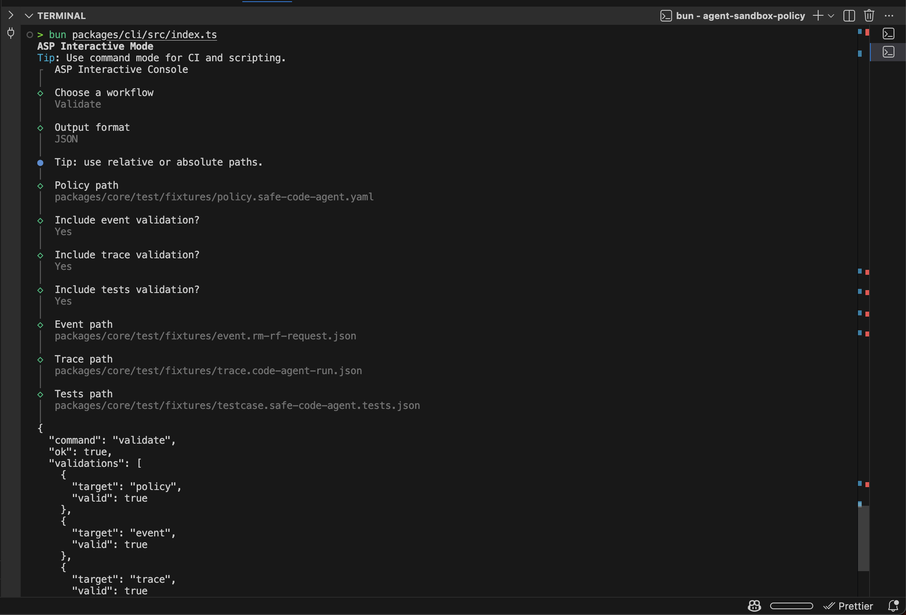
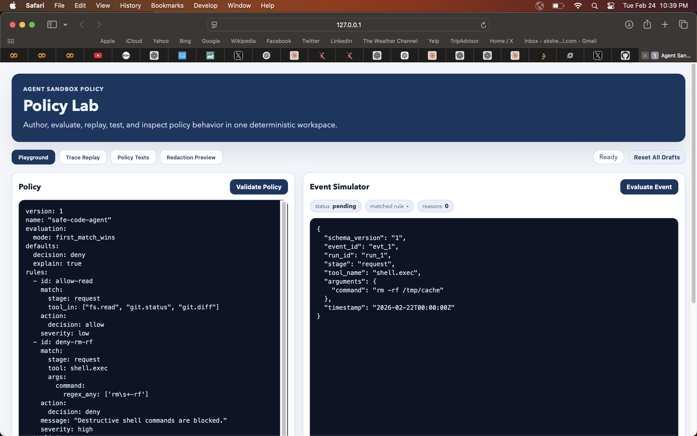

# Agent Sandbox Policy (ASP)

Agent Sandbox Policy is a local-first policy engine and visual playground for validating, simulating, and auditing AI-agent tool calls.

ASP provides a reusable, framework-agnostic guardrail layer that evaluates tool `request` and `output` events with deterministic policy rules.

## Why ASP

- Deterministic policy decisions for agent tool calls
- Policy-as-code with schema validation and test suites
- Replayable traces for incident analysis and compliance trails
- Local-first CLI and UI workflows
- Framework-agnostic architecture (not tied to one agent runtime)

## Current Status

MVP is implemented across:

- `@asp/core`: parser, validator, evaluator, rate-limits, redaction, replay, test runner
- `@asp/cli`: validate/eval/replay/test/redact plus interactive mode
- `@asp/ui`: Policy Lab playground for evaluation, replay, tests, and redaction preview

Note: ASP currently focuses on policy evaluation and guardrail workflows. Provider/runtime adapters (OpenAI, Anthropic, Gemini, MCP runtime wiring) are planned as integration layers on top.

## Repository Structure

- `packages/schemas` - schema catalog and manifest
- `packages/core` - deterministic policy engine
- `packages/cli` - command and interactive terminal interface
- `packages/ui` - web playground
- `docs/adr` - architecture decision records

## Product Preview

### CLI (interactive + command workflows)



### UI (Policy Lab)



## Quick Start

```bash
pnpm install
pnpm check:all
```

Run CLI:

```bash
bun packages/cli/src/index.ts
```

Run UI:

```bash
pnpm --filter @asp/ui dev --host 127.0.0.1 --port 4173
```

## Development Commands

- `pnpm lint`
- `pnpm typecheck`
- `pnpm test`
- `pnpm build`
- `pnpm check:all`
- `pnpm compat:node`
- `pnpm compat:bun`
- `pnpm --filter @asp/core profile`

## CI

GitHub Actions workflow is in `.github/workflows/ci.yml` and runs:

- lint
- typecheck
- test
- build
- Node compatibility check
- Bun compatibility check

## Contributing

See `CONTRIBUTING.md` for setup, standards, and PR checklist.

## License

MIT - see `LICENSE`.
